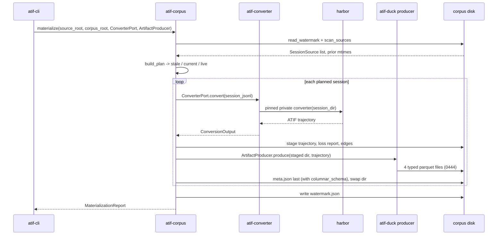
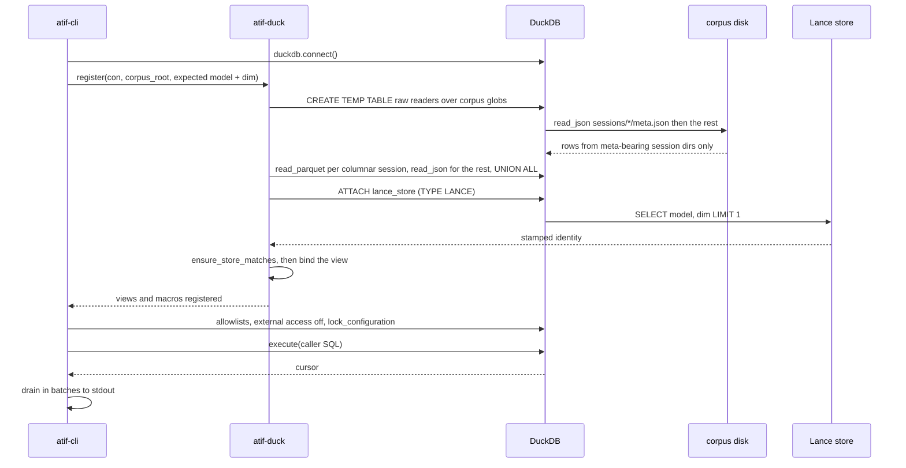
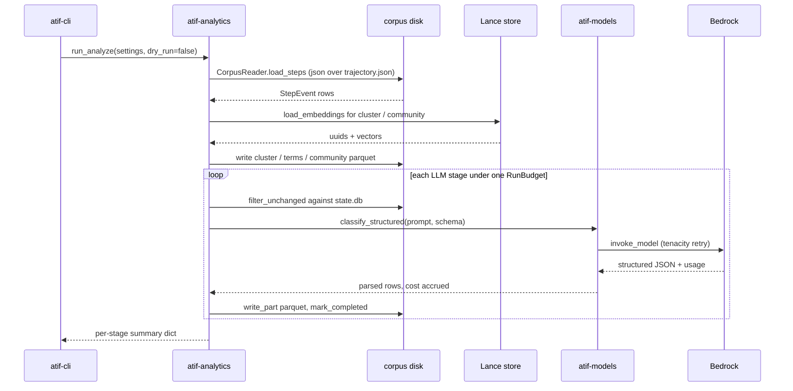

# atif-sql · Data flow

The distribution declares exactly one entry point, the console script
`atif-sql = "atif_cli.app:main"` (`packages/atif-cli/pyproject.toml:42`), and the `main` it names
installs a WARNING-and-up loguru sink and hands control to cyclopts — `packages/atif-cli/src/atif_cli/app.py:1125`.
Every process below therefore begins as a CLI invocation; there is no HTTP, RPC, or queue surface
to enter through.

Two of the three flows below produce the corpus and one consumes it: `materialize` fills
`<corpus_root>/sessions/` (`:339`), `analyze` fills `<corpus_root>/analytics/` (`:627`), and
`query` binds both and runs caller SQL over them (`:497`). The other commands are subsets of
these three — `convert` (`:225`) is one iteration of flow 1's inner loop, `search` (`:828`)
re-enters flow 2's registration at `:886` and adds one kNN statement, `embed` (`:734`) writes the
vector store flows 2 and 3 read, and `schema` (`:1055`), `examples` (`:963`), and `status`
(`:412`) answer from static data or `stat` calls with no downstream participant.

## Flow 1: corpus materialization (`atif-sql materialize`)

1. The `materialize` command resolves `CorpusSettings` (pydantic-settings, env prefix
   `ATIF_SQL_`), then injects the three things the pure use case will not own: the
   `ConverterPort` adapter, the wall-clock instant, and the harbor / converter version pins
   stamped into every `meta.json` — `packages/atif-cli/src/atif_cli/app.py:352`.
2. One pass through the corpus use case runs scan, plan, convert, and write in that order and
   returns a `MaterializationReport` — `packages/atif-corpus/src/atif_corpus/application/materialize.py:476`.
3. The scanner discovers every session under the raw transcript root and separates unreadable
   sessions from absent ones, so a `stat` failure is never mistaken for a deletion — `packages/atif-corpus/src/atif_corpus/infrastructure/scanner.py:143`. It walks whichever layout the
   agent selects, descending exactly `transcript_depth` directories and reporting an unlistable one at
   any level — `packages/atif-corpus/src/atif_corpus/infrastructure/scanner.py:154`.
4. The pure planner partitions the scan into to-materialize, up-to-date, and skipped-live using
   the previous watermark and the quiescence policy; `force` overrides staleness but never
   liveness — `packages/atif-corpus/src/atif_corpus/domain/sessions.py:159`.
5. For each planned session the use case calls `converter.convert` across the port; one session's
   exception is caught and recorded so a single bad transcript cannot abort the sync — `packages/atif-corpus/src/atif_corpus/application/materialize.py:310`.
   By default the sessions are spread over a process pool (`--workers`, default `min(8, cpu_count)`)
   whose workers each hold a pickled copy of the adapter; the pool changes no output byte — `:385`.
6. The adapter that satisfies `ConverterPort` lives in atif-cli because the independence contract
   forbids atif-corpus from importing atif-converter; it raises rather than returning an invalid
   trajectory — `packages/atif-cli/src/atif_cli/converter_adapter.py:51`.
7. Under `--agent codex` the same step runs `convert_codex_and_audit`, which reads the one rollout it
   is given and converts it with our ported Codex converter — `packages/atif-converter/src/atif_converter/application/convert_codex.py:128`.
8. `convert_and_audit` snapshots the source files, converts them with our ported converter
   through the seam at `packages/atif-converter/src/atif_converter/infrastructure/harbor_adapter.py:83`
   (validated by harbor's public `TrajectoryValidator`, `:68`), then builds
   the loss report and edges from the raw records, enriches the trajectory, and refuses the result
   if any source moved mid-pass — `packages/atif-converter/src/atif_converter/application/convert_and_audit.py:105`.
9. The three JSON artifacts are written under `.staging/`, then the `ArtifactProducer` (atif-duck's
   `ColumnarArtifactProducer`, plugged in by the CLI unless `--no-columnar`) writes the four typed
   parquet files beside them and hands back the `columnar_schema` key for `meta.json`; `meta.json`
   is written last and the whole directory swaps into `sessions/<id>/`, so a reader sees one
   complete generation or the other
   (`packages/atif-corpus/src/atif_corpus/application/materialize.py:240`); the watermark advances
   only for sessions that succeeded — `:608`.

## Flow 2: SQL read path (`atif-sql query '<sql>'`)

1. The `query` command resolves the corpus root and reads the active embedder's `(model_id, dim)`
   without constructing the embedder, so the vector store's stamped identity can be checked before
   anything binds over it — `packages/atif-cli/src/atif_cli/app.py:529`.
2. A DuckDB connection is opened with no path or URI, so the engine runs in-process against
   memory — `:591`.
3. Registration builds the whole catalog on that connection in a fixed order — raw TEMP tables,
   base views, VSS, macros, analytics views, analytics macros — because each later stage binds
   against the earlier one at `CREATE` time — `packages/atif-duck/src/atif_duck/infrastructure/registry.py:1212`.
4. The raw readers materialize `meta.json`, `edges.jsonl`, and `loss_report.json` as TEMP TABLEs
   over globs into `<corpus_root>/sessions/`. The trajectory is split per session: a session whose
   `meta.columnar_schema` is current and whose four parquet files are present is read lazily with
   `read_parquet` (typed columns, no JSON parsed at query time), and every other session is parsed
   from `trajectory.json` into a TEMP TABLE over an explicit path list; the two sets are unioned
   into one raw view per surface. The parse cost of a `query` invocation is therefore O(sessions
   without artifacts) per connection — `packages/atif-duck/src/atif_duck/infrastructure/registry.py:402`.
5. Trajectory, edges, and loss readers are semi-joined against the meta table, so a session
   directory missing its `meta.json` contributes nothing rather than a partial artifact set. This
   is the read-side half of flow 1's meta-last write ordering — `packages/atif-duck/src/atif_duck/infrastructure/registry.py:221`.
6. The VSS step `ATTACH`es the LanceDB store through the lance extension (`packages/atif-duck/src/atif_duck/infrastructure/registry.py:887`) and reads the
   store's stamped `model` and `dim` back out (`packages/atif-duck/src/atif_duck/infrastructure/registry.py:921`) before creating any view over it; a store
   written by a different provider or width raises instead of binding, because vectors from
   different models live in incompatible spaces and would return numerically valid but meaningless
   cosine scores — `packages/atif-duck/src/atif_duck/domain/embedding_guard.py:46`.
7. The fully-registered connection is then sandboxed: spill directory, memory cap, a directory
   allowlist holding only the spill area, a path allowlist holding the individual analytics
   parquets, `enable_external_access=false`, and `lock_configuration` last so caller SQL cannot
   widen any of it — `packages/atif-cli/src/atif_cli/app.py:138`.
8. The caller's statement executes against the locked connection (`:606`) and the cursor drains in
   batches to stdout — a JSON array of row objects on a pipe, a width-aligned table on a TTY — `packages/atif-cli/src/atif_cli/output.py:154`.

## Flow 3: analytics enrichment (`atif-sql analyze --no-dry-run`)

1. The `analyze` command loads `AnalyticsSettings`, reuses the same corpus-root resolution the
   other commands share, and stamps explicit `--max-sessions` / `--max-cost-usd` ceilings over the
   env defaults so a crontab line carries its spend cap visibly — `packages/atif-cli/src/atif_cli/app.py:659`.
2. The pipeline runner builds one shared `CorpusReader` for every stage, runs the three structural
   stages, then loops the five LLM stages; the lane selectors and `skip_*` flags subtract stages
   from whichever lane runs — `packages/atif-analytics/src/atif_analytics/application/analyze.py:36`.
3. Corpus rows are read with stdlib `json` over `<corpus_root>/sessions/<id>/trajectory.json`
   behind a bounded memo — not through DuckDB, which the `forbidden` import contract puts out of
   this package's reach — `packages/atif-analytics/src/atif_analytics/infrastructure/corpus_reader.py:269`.
4. The structural lane (cluster, then terms, then community) reads vectors straight out of the
   Lance store and writes single parquet files, bypassing the sharded cache — `packages/atif-analytics/src/atif_analytics/infrastructure/lance_reader.py:28`.
5. Before the LLM lane starts, one `RunBudget` is constructed from the per-run dollar ceiling
   (`packages/atif-analytics/src/atif_analytics/application/analyze.py:140`); all five LLM stages
   then go through one call site, each receiving the shared reader and that budget, and a stage that
   finds the budget exhausted is skipped with nothing stamped — `:181`.
6. A stage drops the sessions whose checkpoint row still matches their mtime and last step
   timestamp, so a re-run costs nothing for unchanged work — `packages/atif-analytics/src/atif_analytics/infrastructure/sqlite_state/checkpointer.py:136`.
7. The concrete provider satisfies `LlmStructuredProvider` structurally, and its synchronous inner
   method is the only place a Bedrock `invoke_model` call is issued, under tenacity retry with
   token usage accumulated against the budget — `packages/atif-models/src/atif_models/infrastructure/openai_bedrock.py:258`.
8. Results land as sharded `part-<ns>.parquet` files under `<corpus_root>/analytics/`
   (`packages/atif-analytics/src/atif_analytics/infrastructure/parquet_cache.py:90`), and each
   completed session is upserted into the SQLite WAL checkpoint — `packages/atif-analytics/src/atif_analytics/infrastructure/sqlite_state/checkpointer.py:179`.

## See also

- [processes](../behavior/processes.md) — 16 shared source citations
- [sequences](../diagrams/behavioral/sequences.md) — 16 shared source citations
- [module map](module-map.md) — 13 shared source citations
- [debugging guide](../insights/debugging-guide.md) — 13 shared source citations
- [components](../diagrams/architecture/components.md) — 12 shared source citations
