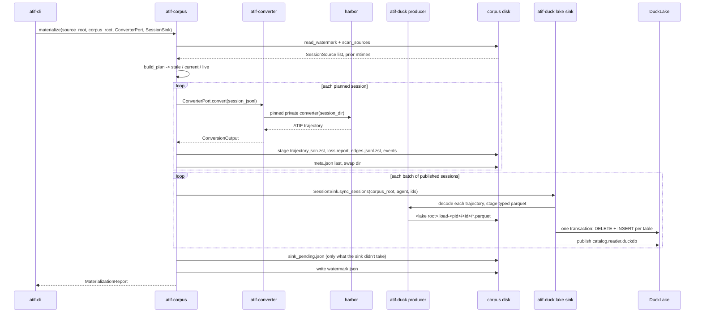
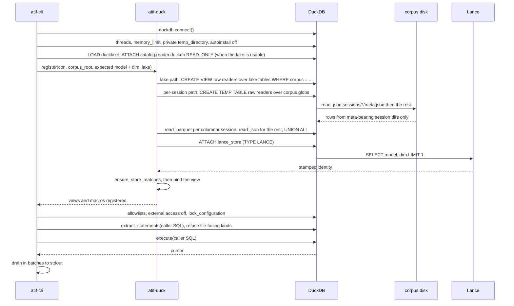
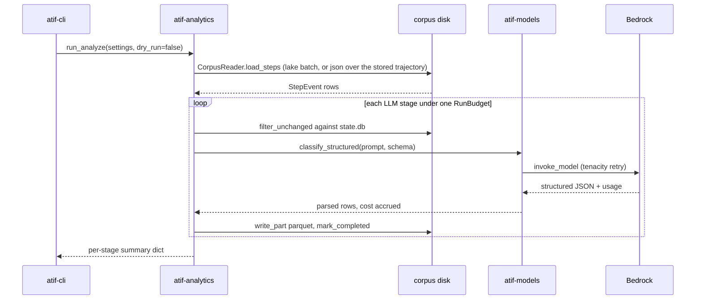

# atif-sql · Data flow

The distribution declares exactly one entry point, the console script
`atif-sql = "atif_cli.app:main"` (`packages/atif-cli/pyproject.toml:42`), and the `main` it names
installs a WARNING-and-up loguru sink and hands control to cyclopts (`packages/atif-cli/src/atif_cli/app.py:1125`).
Every process below therefore begins as a CLI invocation; there is no HTTP, RPC, or queue surface
to enter through.

The flows below either produce the corpus or consume it: `materialize` fills
`<corpus_root>/sessions/` (`:339`), `analyze` fills `<corpus_root>/analytics/` (`:627`), and
`query` binds both and runs caller SQL over them (`:497`). The other commands are subsets of
these flows: `convert` (`:225`) is one iteration of flow 1's inner loop, `search` (`:828`)
re-enters flow 2's registration at `:886` and adds one kNN statement, `embed` (`:734`) writes the
vector store flows 2 and 3 read, and `schema` (`:1055`), `examples` (`:963`), and `status`
(`:412`) answer from static data or `stat` calls with no downstream participant.

`materialize` also keeps the DuckLake beside the corpora current (flow 1, step 10), and `query`
reads it when it can (flow 2, step 4). `lake rebuild` loads it from every corpus's artifacts and
swaps the new directory in; `lake verify` reads both sides and compares them; `lake compact`
merges and expires under the same writer lock materialize takes; `lake status` reads the published
catalog copy.

## Flow 1: corpus materialization (`atif-sql materialize`)

1. The `materialize` command resolves `CorpusSettings` (pydantic-settings, env prefix
   `ATIF_SQL_`), then injects what the pure use case will not own: the
   `ConverterPort` adapter, the wall-clock instant, and the harbor / converter version pins
   stamped into every `meta.json` (`packages/atif-cli/src/atif_cli/app.py:352`).
2. One pass through the corpus use case runs scan, plan, convert, and write in that order and
   returns a `MaterializationReport` (`packages/atif-corpus/src/atif_corpus/application/materialize.py:476`).
3. The scanner discovers every session under the raw transcript root and separates unreadable
   sessions from absent ones, so a `stat` failure is never mistaken for a deletion (`packages/atif-corpus/src/atif_corpus/infrastructure/scanner.py:143`). It walks whichever layout the
   agent selects, descending exactly `transcript_depth` directories and reporting an unlistable one at
   any level (`packages/atif-corpus/src/atif_corpus/infrastructure/scanner.py:154`).
4. The pure planner partitions the scan into to-materialize, up-to-date, and skipped-live using
   the previous watermark and the quiescence policy; `force` overrides staleness but never
   liveness (`packages/atif-corpus/src/atif_corpus/domain/sessions.py:159`).
5. For each planned session the use case calls `converter.convert` across the port; one session's
   exception is caught and recorded so a single bad transcript cannot abort the sync (`packages/atif-corpus/src/atif_corpus/application/materialize.py:310`).
   By default the sessions are spread over a process pool (`--workers`, default `min(8, cpu_count)`)
   whose workers each hold a pickled copy of the adapter; the pool changes no output byte (`:385`).
6. The adapter that satisfies `ConverterPort` lives in atif-cli because the independence contract
   forbids atif-corpus from importing atif-converter; it raises rather than returning an invalid
   trajectory (`packages/atif-cli/src/atif_cli/converter_adapter.py:51`).
7. Under `--agent codex` the same step runs `convert_codex_and_audit`, which reads the one rollout it
   is given and converts it with our ported Codex converter (`packages/atif-converter/src/atif_converter/application/convert_codex.py:128`).
8. `convert_and_audit` reads the source files once (fingerprinted and parsed in the same pass,
   `harbor_adapter.read_session`), converts those records with our ported converter through the
   seam at `packages/atif-converter/src/atif_converter/infrastructure/harbor_adapter.py`
   (`convert_loaded_session`, validated by harbor's public `TrajectoryValidator`), then builds
   the loss report and edges from the same records, enriches the trajectory, and refuses the result
   if any source moved since the read (`packages/atif-converter/src/atif_converter/application/convert_and_audit.py:105`).
9. The artifacts are written under `.staging/`: `trajectory.json.zst`, `edges.jsonl.zst` and
   `session_events.jsonl.zst` (zstd, each decompressing to the plain file an earlier version
   wrote), then `loss_report.json`. No per-session parquet is written; the CLI wires no
   `ArtifactProducer`. `meta.json` is written last and the whole directory swaps into
   `sessions/<id>/`, so a reader sees one complete generation or the other
   (`packages/atif-corpus/src/atif_corpus/application/materialize.py:240`); the watermark advances
   only for sessions that succeeded (`:608`).
10. Before the first swap, the pass records every session it may publish or mark in
   `<corpus>/sink_pending.json`. After the swaps, still in the parent process, it hands the
   `SessionSink` (atif-duck's `DuckLakeSessionSink`, plugged in by the CLI unless `--no-lake`) every
   session it published or marked source-removed, plus any left pending by an earlier pass, in plan
   order and in batches. Each batch is one lake transaction that deletes and re-inserts those
   sessions' rows in every lake table, then the writer publishes a fresh read-only copy of the lake
   catalog. What the sink took leaves the pending file; a failure keeps that batch and every later
   one there for the next pass and never fails this one (`_SinkLedger` in
   `packages/atif-corpus/src/atif_corpus/application/materialize.py`,
   `packages/atif-duck/src/atif_duck/infrastructure/lake.py`).
11. The sink reads each session into the batch by staging it: the stored trajectory is decoded in
   Python, typed into parquet by `ColumnarArtifactProducer` under `<lake root>.load-<pid>/`, and
   read from there, then deleted when the batch commits. A session written by an earlier version
   that still has current parquet of its own is read from that instead (`_staged_columnar` in
   `packages/atif-duck/src/atif_duck/infrastructure/lake.py`).

```mermaid
sequenceDiagram
    participant CLI as atif-cli
    participant Corpus as atif-corpus
    participant Conv as atif-converter
    participant Harbor as harbor
    participant Producer as atif-duck producer
    participant Disk as corpus disk
    participant Sink as atif-duck lake sink
    participant Lake as DuckLake

    CLI->>Corpus: materialize(source_root, corpus_root, ConverterPort, SessionSink)
    Corpus->>Disk: read_watermark + scan_sources
    Disk-->>Corpus: SessionSource list, prior mtimes
    Corpus->>Corpus: build_plan -> stale / current / live
    loop each planned session
        Corpus->>Conv: ConverterPort.convert(session_jsonl)
        Conv->>Harbor: pinned private converter(session_dir)
        Harbor-->>Conv: ATIF trajectory
        Conv-->>Corpus: ConversionOutput
        Corpus->>Disk: stage trajectory.json.zst, loss report, edges.jsonl.zst, events
        Corpus->>Disk: meta.json last, swap dir
    end
    loop each batch of published sessions
        Corpus->>Sink: SessionSink.sync_sessions(corpus_root, agent, ids)
        Sink->>Producer: decode each trajectory, stage typed parquet
        Producer->>Disk: <lake root>.load-<pid>/<id>/*.parquet
        Sink->>Lake: one transaction: DELETE + INSERT per table
        Sink->>Lake: publish catalog.reader.duckdb
    end
    Corpus->>Disk: sink_pending.json (only what the sink didn't take)
    Corpus->>Disk: write watermark.json
    Corpus-->>CLI: MaterializationReport
```

## Flow 2: SQL read path (`atif-sql query '<sql>'`)

1. The `query` command resolves the corpus root and reads the active embedder's `(model_id, dim)`
   without constructing the embedder, so the vector store's stamped identity can be checked before
   anything binds over it (`packages/atif-cli/src/atif_cli/app.py:529`).
2. A DuckDB connection is opened with no path or URI, so the engine runs in-process against
   memory (`:591`).
3. Registration builds the whole catalog on that connection in a fixed order (raw TEMP tables,
   base views, VSS, macros, the authorship macro and views, analytics views, analytics macros),
   because each later stage binds against the earlier one at `CREATE` time (`packages/atif-duck/src/atif_duck/infrastructure/registry.py:1679`).
4. When the DuckLake at `ATIF_SQL_LAKE_ROOT` exists, its recorded schema matches the running code,
   and it holds this corpus at this root, the raw relations are views over the lake tables instead,
   filtered to this corpus (`--all-corpora` drops the filter): the command loads the ducklake
   extension (it never installs one) and attaches the published `catalog.reader.duckdb` READ_ONLY
   before the sandbox goes up, since the sandbox refuses `ATTACH`. Nothing is read eagerly; every
   view is a lake scan when the caller's statement runs, and the rest of registration binds over
   those views as it would over the per-session ones (`attach_lake_for_query` and
   `register_lake_raw` in `packages/atif-duck/src/atif_duck/infrastructure/lake.py`). Otherwise the
   command prints one warning saying why and takes the per-session path below.
5. On the per-session path, the raw readers materialize `meta.json`, the edges, and `loss_report.json` as TEMP TABLEs
   over `<corpus_root>/sessions/`, each session's edges from its stored file (`edges.jsonl.zst`, or
   `edges.jsonl` on an old-layout session). The trajectory is split per session: an old-layout
   session whose `meta.columnar_schema` is current and whose parquet files are present is read
   lazily with `read_parquet`, and every other session is parsed from its stored trajectory
   (DuckDB's JSON reader decompresses a `.zst` file itself) into a TEMP TABLE over an explicit
   path list; the two sets are unioned
   into one raw view per surface. The parse cost of a `query` invocation is therefore O(sessions
   without artifacts) per connection (`packages/atif-duck/src/atif_duck/infrastructure/registry.py:402`).
6. Trajectory, edges, and loss readers are semi-joined against the meta table, so a session
   directory missing its `meta.json` contributes nothing rather than a partial artifact set. This
   is the read-side half of flow 1's meta-last write ordering (`packages/atif-duck/src/atif_duck/infrastructure/registry.py:221`).
7. The VSS step `ATTACH`es the LanceDB store through the lance extension (`packages/atif-duck/src/atif_duck/infrastructure/registry.py:887`) and reads the
   store's stamped `model` and `dim` back out (`packages/atif-duck/src/atif_duck/infrastructure/registry.py:921`) before creating any view over it; a store
   written by a different provider or width raises instead of binding, because vectors from
   different models live in incompatible spaces and would return numerically valid but meaningless
   cosine scores (`packages/atif-duck/src/atif_duck/domain/embedding_guard.py:46`).
8. Before any of that, the connection was sized to the host (`_configure_query_resources`: a memory
   cap from available RAM, a thread count from that cap, a private `mkdtemp` spill directory, and
   extension auto-install and auto-load off), because registration is what needs the cap. The
   fully registered connection is then sandboxed: a directory allowlist holding only the private
   spill area, a path allowlist holding the individual parquets the views read lazily (on the lake
   path, each live lake data and delete file, never the lake's data directory, because a caller's
   `ducklake_cleanup_old_files` deletes files under a directory grant),
   `enable_external_access=false`, and `lock_configuration` last so caller SQL cannot widen any of
   it (`packages/atif-cli/src/atif_cli/app.py`, `_harden_query_connection`).
9. The statement's kinds are checked with DuckDB's own parser on the locked connection; `COPY`,
   `EXPORT`, `ATTACH`, `DETACH`, `INSTALL`, `LOAD`, `PREPARE` and `EXECUTE` exit 70
   (`sandbox_refused`) before anything runs. Then the caller's statement executes and the cursor
   drains in batches to stdout: a JSON array of row objects on a pipe, a width-aligned table on a
   TTY (`packages/atif-cli/src/atif_cli/output.py:154`). The spill directory is removed when the
   process exits.

```mermaid
sequenceDiagram
    participant CLI as atif-cli
    participant Duck as atif-duck
    participant DB as DuckDB
    participant Disk as corpus disk

    CLI->>DB: duckdb.connect()
    CLI->>DB: threads, memory_limit, private temp_directory, autoinstall off
    CLI->>DB: LOAD ducklake, ATTACH catalog.reader.duckdb READ_ONLY (when the lake is usable)
    CLI->>Duck: register(con, corpus_root, expected model + dim, lake)
    Duck->>DB: lake path: CREATE VIEW raw readers over lake tables WHERE corpus = ...
    Duck->>DB: per-session path: CREATE TEMP TABLE raw readers over corpus globs
    DB->>Disk: read_json sessions/*/meta.json then the rest
    Disk-->>DB: rows from meta-bearing session dirs only
    Duck->>DB: read_parquet per columnar session, read_json for the rest, UNION ALL
    Duck->>DB: ATTACH lance_store (TYPE LANCE)
    DB->>Lance: SELECT model, dim LIMIT 1
    Lance-->>Duck: stamped identity
    Duck->>Duck: ensure_store_matches, then bind the view
    Duck-->>CLI: views and macros registered
    CLI->>DB: allowlists, external access off, lock_configuration
    CLI->>DB: extract_statements(caller SQL), refuse file-facing kinds
    CLI->>DB: execute(caller SQL)
    DB-->>CLI: cursor
    CLI->>CLI: drain in batches to stdout
```

## Flow 3: analytics enrichment (`atif-sql analyze --no-dry-run`)

1. The `analyze` command loads `AnalyticsSettings`, reuses the same corpus-root resolution the
   other commands share, and stamps explicit `--max-sessions` / `--max-cost-usd` ceilings over the
   env defaults so a crontab line carries its spend cap visibly (`packages/atif-cli/src/atif_cli/app.py:1240`).
2. The command opens the lake's session source when the lake holds the corpus
   (`packages/atif-cli/src/atif_cli/app.py:1624`, `packages/atif-cli/src/atif_cli/lake_sessions.py:83`),
   and the pipeline runner builds one shared `CorpusReader` over it (or over the file source)
   for every stage and loops the LLM stages (classify, conflicts, friction, perceived); the
   `skip_*` flags subtract stages (`packages/atif-analytics/src/atif_analytics/application/analyze.py:62`).
3. On the lake, a session whose lake rows match its current `meta.json` is read with batched
   statements over the step-level tables (`packages/atif-duck/src/atif_duck/infrastructure/lake_sessions.py:71`),
   reading ahead in the newest-first walk order, and every other session from its files. Without
   a lake, rows are read with stdlib `json` over `<corpus_root>/sessions/<id>/trajectory.json.zst` (or the plain file on an old-layout session);
   atif-analytics never imports DuckDB or atif-duck, which the `forbidden` import contract puts
   out of its reach (`packages/atif-analytics/src/atif_analytics/infrastructure/corpus_reader.py:225`).
   Either way the steps sit behind the reader's bounded memos
   (`packages/atif-analytics/src/atif_analytics/infrastructure/corpus_reader.py:263`), and the
   reader labels each session's kind with the same rule `session_outcomes.kind` applies, so
   classify and conflicts can skip `turn_audit` and `one_shot_job` sessions.
4. Before the first stage starts, one `RunBudget` is constructed from the per-run dollar ceiling
   (`packages/atif-analytics/src/atif_analytics/application/analyze.py:83`); every stage then goes
   through one call site, each receiving the shared reader and that budget, and a stage that finds
   the budget exhausted is skipped with nothing stamped (`:123`).
5. A stage drops the sessions whose checkpoint row still matches their mtime and last step
   timestamp, so a re-run costs nothing for unchanged work (`packages/atif-analytics/src/atif_analytics/infrastructure/sqlite_state/checkpointer.py:137`).
6. The concrete provider satisfies `LlmStructuredProvider` structurally, and its synchronous inner
   method is the only place a Bedrock `invoke_model` call is issued, under tenacity retry with
   token usage accumulated against the budget (`packages/atif-models/src/atif_models/infrastructure/openai_bedrock.py:258`).
7. Results land as sharded `part-<ns>.parquet` files under `<corpus_root>/analytics/`
   (`packages/atif-analytics/src/atif_analytics/infrastructure/parquet_cache.py:90`), and each
   completed session is upserted into the SQLite WAL checkpoint (`packages/atif-analytics/src/atif_analytics/infrastructure/sqlite_state/checkpointer.py:180`).

```mermaid
sequenceDiagram
    participant CLI as atif-cli
    participant Ana as atif-analytics
    participant Disk as corpus disk
    participant Models as atif-models
    participant Bedrock as Bedrock

    CLI->>Ana: run_analyze(settings, dry_run=false)
    Ana->>Disk: CorpusReader.load_steps (lake batch, or json over the stored trajectory)
    Disk-->>Ana: StepEvent rows
    loop each LLM stage under one RunBudget
        Ana->>Disk: filter_unchanged against state.db
        Ana->>Models: classify_structured(prompt, schema)
        Models->>Bedrock: invoke_model (tenacity retry)
        Bedrock-->>Models: structured JSON + usage
        Models-->>Ana: parsed rows, cost accrued
        Ana->>Disk: write_part parquet, mark_completed
    end
    Ana-->>CLI: per-stage summary dict
```

## See also

- [processes](../behavior/processes.md)
- [sequences](../diagrams/behavioral/sequences.md)
- [module map](module-map.md)
- [debugging guide](../insights/debugging-guide.md)
- [components](../diagrams/architecture/components.md)
