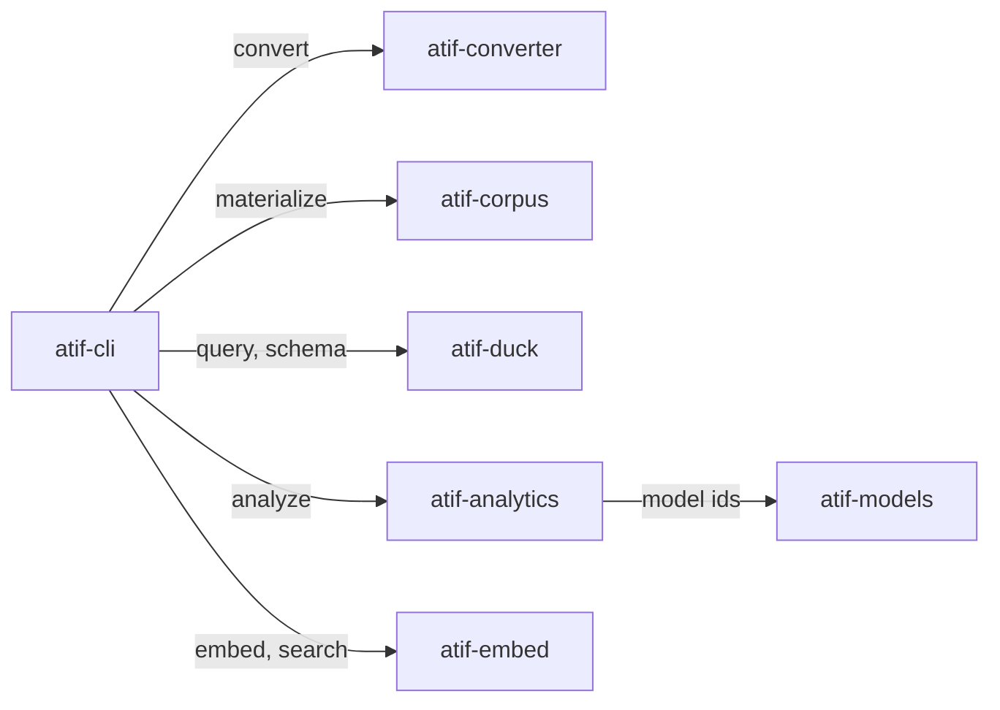

# atif-sql · System overview

## What it does

`atif-sql` is a command-line analytics tool over Claude Code agent trajectories. It reads the
session transcripts Claude Code leaves at `~/.claude/projects/**/*.jsonl`, converts each one to
ATIF — Harbor's Agent Trajectory Interchange Format — materializes the results as an on-disk
corpus, and answers SQL against that corpus through DuckDB (`README.md:12`). The design bet is
stated in the README itself: converting once at the boundary, with an explicit and tested fidelity
policy for what the upstream converter drops, beats re-deriving trajectory semantics inside every
SQL view (`README.md:15`). The reader it serves is an engineer or an agent asking how sessions
actually went — which tools ran, where tokens went, where a session turned into friction.

Users get one installable distribution and one console script,
`atif-sql = "atif_cli.app:main"` (`packages/atif-cli/pyproject.toml:42`), installed with
`uv tool install atif-sql` (`README.md:26`). The command surface is ten commands: nine registered
with `@app.command` in `packages/atif-cli/src/atif_cli/app.py` (1120 LOC) plus the `cron` sub-app
attached at `:65`. Nothing here is a server — DuckDB is embedded
(`packages/atif-duck/pyproject.toml:20`), as are the SQLite analytics state file and the LanceDB
vector store. Three commands, `analyze` / `embed` / `search`, call Amazon Bedrock and spend money
per invocation, and each is dry-run by default (`README.md:37`).

## How the pieces fit

The seven directories under `packages/` are internal module boundaries, not seven installs
(`README.md:43`); they are uv workspace members (`pyproject.toml:100`). `atif-converter` wraps
Harbor's `ClaudeCode` adapter, pinned `harbor>=0.22.0,<0.23`
(`packages/atif-converter/pyproject.toml:23`) because it calls a private upstream method verified
against 0.22.0 only (`:20`), and owns the fidelity policy as types: `FidelityGap` enumerates the
seven known upstream conversion gaps
(`packages/atif-converter/src/atif_converter/domain/fidelity.py:44`, 137 LOC). `atif-corpus`
drives materialization, writing per-session artifacts plus a corpus watermark
(`docs/CONTRACT.md:21`). Its `ConverterPort` Protocol lets an implementation raise anything: the
materialize use case records the failure against that session and continues, so one broken
transcript never aborts a sync (`packages/atif-corpus/src/atif_corpus/domain/ports.py:41`).

`atif-duck` reads the corpus root and never imports the packages that wrote it
(`docs/CONTRACT.md:52`). Its one public `register` registers raw readers, views, vector search, and
macros in that order, because views bind against the raw TEMP tables at CREATE time
(`packages/atif-duck/src/atif_duck/infrastructure/registry.py:1222`); the raw readers are
`CREATE TEMP TABLE` over `read_json` (`:13`), and every view and macro name is declared in a static
catalog (`packages/atif-duck/src/atif_duck/domain/catalog.py:28`, 417 LOC). `atif-analytics` is the
largest module at 35 source files; it writes parquet plus one SQLite WAL `state.db` under
`<corpus_root>/analytics/` (`packages/atif-analytics/src/atif_analytics/domain/layout.py:6`).
`atif-embed` backfills Cohere Embed v4 vectors into LanceDB
(`packages/atif-embed/pyproject.toml:4`), which `atif-duck` reads back through DuckDB's lance
extension rather than by importing lancedb
(`packages/atif-duck/src/atif_duck/infrastructure/registry.py:830`). `atif-models` is the single
owner of model ids, so no other package hardcodes one (`packages/atif-models/pyproject.toml:4`).

The direction of those edges is enforced rather than conventional. `[tool.importlinter]`
(`pyproject.toml:462`) declares a layer contract per member, an independence contract forbidding
converter / corpus / duck / models / embed from importing each other (`:417`), and a forbidden
contract limiting `atif-analytics` to `atif-models` alone among the seven (`:422`). `atif-cli` is
the sole composition root, and it imports its five siblings lazily inside command bodies
(`packages/atif-cli/src/atif_cli/app.py:388`, `:583`, `:688`) so that `atif-sql schema` pays for
none of the analytics or vector stack. Failures surface as typed exceptions mapped to stable
process exit codes at the CLI edge (`:38`).

## Stack

| Layer | Technology | Source |
| --- | --- | --- |
| Language | Python, `requires-python = ">=3.13"` | `packages/atif-cli/pyproject.toml:14` |
| Toolchain pin | mise, `python = "3.13"` | `mise.toml:32` |
| Packaging | uv workspace, `members = ["packages/*"]` | `pyproject.toml:100` |
| Build backend | `uv_build>=0.11.14,<0.12` | `packages/atif-cli/pyproject.toml:48` |
| CLI framework | `cyclopts>=4.10.2` | `packages/atif-cli/pyproject.toml:37` |
| Query engine | `duckdb>=1.5.2,<2` | `packages/atif-duck/pyproject.toml:20` |
| Trajectory conversion | `harbor>=0.22.0,<0.23` | `packages/atif-converter/pyproject.toml:23` |
| Vector store | `lancedb>=0.30,<0.38` | `packages/atif-embed/pyproject.toml:22` |
| Model access | `boto3>=1.42.91` for Bedrock | `packages/atif-models/pyproject.toml:24` |
| Dataframes | `polars>=1.40.0` | `packages/atif-embed/pyproject.toml:24` |
| Validation | `pydantic>=2.13.2` | `packages/atif-converter/pyproject.toml:25` |
| Logging | `loguru>=0.7.3` | `packages/atif-corpus/pyproject.toml:19` |
| Lint and format | ruff, `select = ["ALL"]` | `pyproject.toml:146` |
| Architecture gate | import-linter contracts | `pyproject.toml:462` |
| Tests | pytest, `testpaths = ["packages/*/tests"]` | `pyproject.toml:389` |
| Definition of done | `mise run check`, nine gates | `mise.toml:197` |

## Module map

Nodes are the seven uv workspace members. Every edge is an import confirmed at an import site.
There is no `atif-corpus` to `atif-converter` edge — the independence contract forbids it, and
`RealConverter` in `packages/atif-cli/src/atif_cli/converter_adapter.py:44` (72 LOC) satisfies
`ConverterPort` by importing both from the composition root (`:36`, `:38`). `atif-duck`,
`atif-analytics`, and `atif-embed` exchange data through corpus files on disk, never through an
import.

## See also

- [contract map](../insights/contract-map.md) — 11 shared source citations
- [dependency graph](../diagrams/structural/dependency-graph.md) — 10 shared source citations
- [impact analysis](../insights/impact-analysis.md) — 10 shared source citations
- [module map](module-map.md) — 9 shared source citations
- [processes](../behavior/processes.md) — 8 shared source citations
