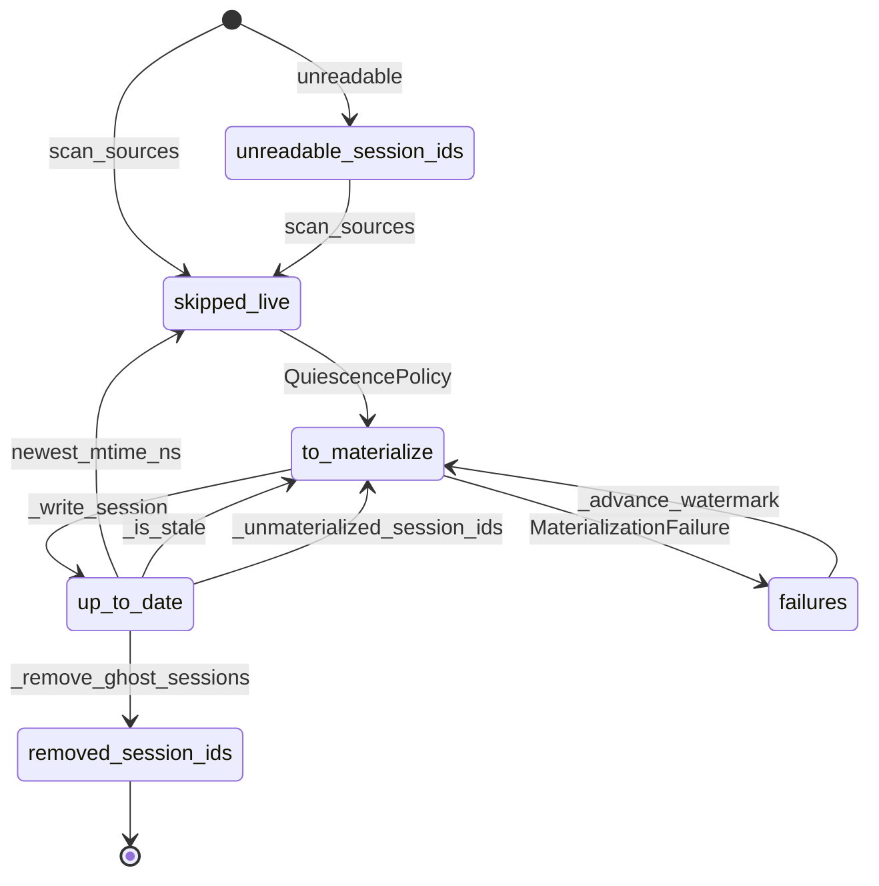
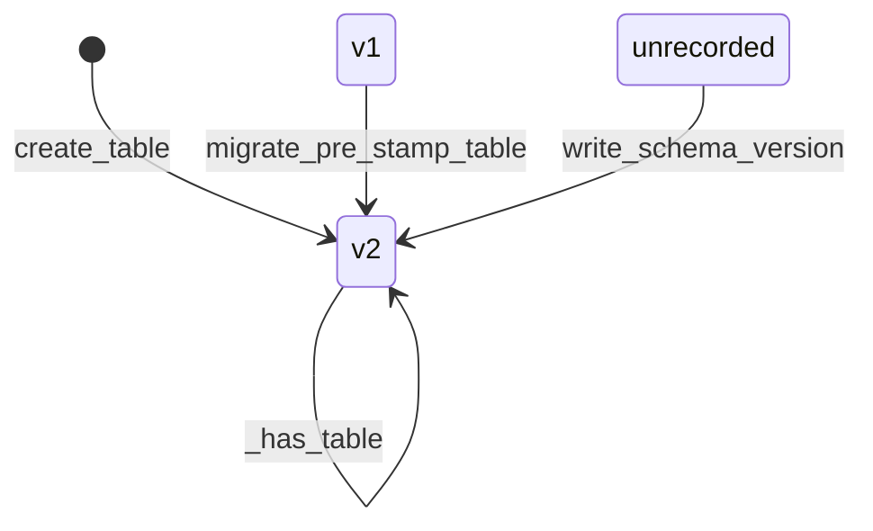
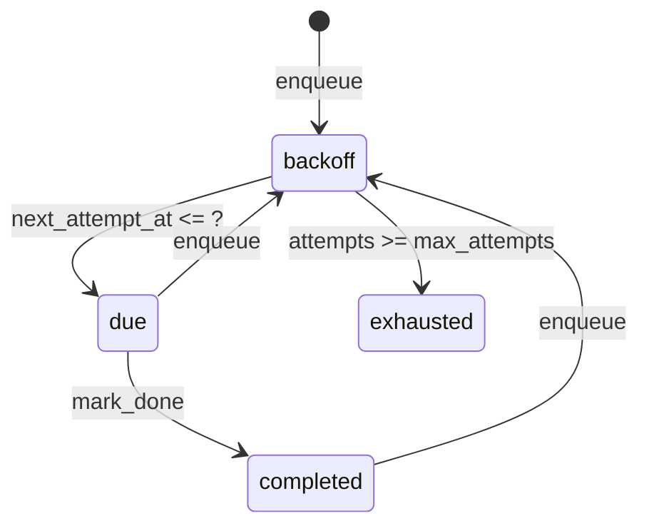

# atif-sql · State machines

No entity in this workspace carries a `status` enum with declared transitions. The workspace declares
exactly three enums. `RecordType` (`packages/atif-converter/src/atif_converter/domain/fidelity.py:18`)
and `FidelityGap` (`:44`) are closed classification vocabularies whose members never move into one
another. `OutputFormat` (`packages/atif-cli/src/atif_cli/output.py:58`) has one resolution —
`resolve_format` maps `AUTO` to `TABLE` on a TTY and `JSON` otherwise (`:79-81`) — but that is an
idempotent pure function evaluated per emit, a no-op for every explicit format (`:74-80`), whose result
is never stored and never advances again. One irreversible resolution with no persisted state is not a
lifecycle.

The three machines below are durable-state lifecycles instead: the state lives in a row, a sidecar
file, or the presence of a directory, and named functions move an entity between named states. State
names and transition labels are verbatim source text from each machine's `Defined at:` file.

## Corpus session materialization

Every pass over the raw transcript corpus reclassifies each discovered session from scratch, so the
state is not a stored field — it is the pair "what the watermark records" and "whether the session's
artifact directory exists". The classification is the `if / elif / else` at
`packages/atif-corpus/src/atif_corpus/domain/sessions.py:200-206`, and the outcome states are the
counters and id tuples of `MaterializationReport`
(`packages/atif-corpus/src/atif_corpus/application/materialize.py:117-157`).

- `skipped_live` is the entry state, not an error state. A transcript is appended to many times per
  turn, and a session qualifies to convert only once its newest source mtime is at least
  `quiesce_seconds` old — 300 by default (`packages/atif-corpus/src/atif_corpus/domain/sessions.py:81`).
  `force` overrides staleness but never quiescence, because converting a half-written transcript
  produces a wrong artifact rather than a stale one (`:170-174`).
- `failures --> to_materialize` is the retry, and it works only because `_advance_watermark` retains
  the failed session's entries. Staleness is "recorded set differs from scanned set", so the retained
  entry *is* the retry signal; dropping it would classify the session `up_to_date` forever
  (`packages/atif-corpus/src/atif_corpus/application/materialize.py:435-448`).
- `up_to_date --> to_materialize: _unmaterialized_session_ids` is the crash-recovery edge. It is
  reachable exactly one way — a pass killed inside the directory swap, after the previous generation
  was renamed aside and before the new one landed. The watermark records source mtimes only and cannot
  express a missing artifact directory, so the directory check is what force-replans it (`:302-328`).
- `unreadable_session_ids` is a parking state, and the only state a session can starve in. A transient
  stat failure clears next pass; a permanent one (a side-file left at mode 000) leaves the session
  never materialized, never `up_to_date`, never `skipped_live`, and deliberately never ghosted, which
  is why the report carries the ids at all (`:135-142`).
- `removed_session_ids` is the sole terminal state: `shutil.rmtree` deletes the corpus session
  directory (`:411`) and `_advance_watermark` drops its entries, because the raw source is
  authoritative and there are no tombstones (`:386-392`). A session whose sources merely could not be
  read is never ghosted (`:404-410`), and a scan that found zero sessions over a non-empty corpus
  raises `SuspiciousEmptyScanError` instead of removing everything (`:542-548`).
- Transition sites: `scan_sources` at `:522`; `QuiescencePolicy` at `:575`; `_write_session` at `:588`;
  `MaterializationFailure` at `:599`; `_remove_ghost_sessions` at `:562`; `_advance_watermark` at
  `:610`.

Defined at: `packages/atif-corpus/src/atif_corpus/application/materialize.py:476`

## Embed store schema version

The vector store's state is a schema generation recorded in a `schema_version.json` sidecar next to
the Lance table, written on create and checked on open. A sidecar rather than a table column, because
the version describes the schema and reading it must not require the schema to be readable
(`packages/atif-embed/src/atif_embed/infrastructure/lance_store.py:63-67`). `SCHEMA_VERSION` is `2`
(`:59`).

- `v1` and `unrecorded` have no incoming edge on purpose. This code never writes either state; it
  discriminates a store it finds on disk. `v1` is the five-column shape lacking `text_hash` and
  `truncated`; `unrecorded` is a store whose columns are already current but whose sidecar is absent,
  which `read_schema_version` reports as `None` (`:141-154`).
- `v1 --> v2` is online and metadata-only. `migrate_pre_stamp_table` adds the two columns through
  Lance schema evolution with SQL default expressions — no rows dropped, no vectors re-embedded, and
  readers keep working throughout (`:164-190`). `text_hash` backfills to `_PRE_STAMP_SENTINEL`, the
  literal `<pre-stamp>` (`:71`), whose angle brackets make it impossible to equal a real blake2b
  digest; every migrated row therefore mismatches its corpus hash in the discovery anti-join and
  re-embeds incrementally through the ordinary staleness path (`:67-70`).
- `v2 --> v2: _has_table` is idempotent reopening. `migrate_pre_stamp_table` returns early when
  nothing is missing (`:180-181`) and the sidecar stamp is left alone.
- The machine has no terminal state in source. `v2` is absorbing; the store is never dropped here.
  A breaking change — a provider or dimension switch — is refused rather than migrated, and stays
  fail-loud through `embedding_guard` (`:25-27`).

Defined at: `packages/atif-embed/src/atif_embed/infrastructure/lance_store.py:195`

## Retry-queue row

One row per `(pipeline, unit_id)` in the `retry_queue` table of the analytics `state.db`. The state is
the triple "is `completed_at` NULL", "`attempts` against `max_attempts`", and "`next_attempt_at`
against now". The transition table is written as source at
`packages/atif-analytics/src/atif_analytics/infrastructure/sqlite_state/retry_queue.py:12-16`, and the
columns holding the state are declared at `:45-56`.

- The first `enqueue` lands in `backoff`, never `due`: it stamps `next_attempt_at` at now plus
  `_backoff_delta(1)`, which is two minutes (`:78-81`, `:109`). Backoff is exponential in minutes —
  2, 4, 8, 16, 32 — and `_BACKOFF_CAP_MIN` clamps it at 60 (`:43`, `:79`). That clamp is defensive
  rather than reachable at the shipped default: `drain` admits a unit only while
  `attempts < max_attempts` (`:145`), so with `MAX_ATTEMPTS_DEFAULT` of 5 (`:42`) the largest value
  `_backoff_delta` receives is 5 and the longest real wait is 32 minutes.
- `backoff` and `exhausted` together are exactly what `blocked_units` returns, and `due` is what
  `drain` returns; the two are complementary partitions of the live rows (`:159-190`, `:128-156`).
  Together they make the queue the single re-admission gate for a failed unit: a failed unit is not
  checkpointed, so without the `blocked_units` subtraction the checkpoint path would re-admit and
  re-bill it on every run (`:166-176`).
- `exhausted` is terminal in effect and has no outgoing edge. `drain` never returns it, so the
  pipeline never dispatches it, so it never fails again and is never marked done. The guard is
  `keep -= blocked` at
  `packages/atif-analytics/src/atif_analytics/application/use_cases/classify.py:123`, spelled
  `active_sessions -= blocked` in
  `packages/atif-analytics/src/atif_analytics/application/use_cases/trajectory.py:193` and
  `already |= blocked` in
  `packages/atif-analytics/src/atif_analytics/application/use_cases/friction.py:280`, whose unit is a
  message uuid rather than a session id. `exhausted` is a parking state rather than a deleted row:
  the module issues no `DELETE`, and raising `max_attempts` on a `drain` call re-admits it.
- `completed --> backoff` is real, and the attempt counter survives it. `enqueue` clears
  `completed_at` back to NULL on conflict
  (`packages/atif-analytics/src/atif_analytics/infrastructure/sqlite_state/retry_queue.py:128-133`)
  while reading the prior `attempts` with no filter on `completed_at` (`:103-108`), so a unit that
  failed four times, succeeded, then failed again re-enters at `attempts = 5` and is `exhausted`
  immediately under the default `MAX_ATTEMPTS_DEFAULT` of 5 (`:42`). Every state name here is a row
  predicate, not a stored string; the table has no status column (`:45-56`).

All five pipelines named by `PIPELINE_NAMES`
(`packages/atif-analytics/src/atif_analytics/infrastructure/sqlite_state/checkpointer.py:35-41`) fire
the identical four-call sequence — `drain`, then `blocked_units`, then `enqueue` on failure and
`mark_done` on success:

| pipeline | `drain` | `blocked_units` | `enqueue` | `mark_done` |
| --- | --- | --- | --- | --- |
| `classify` | `packages/atif-analytics/src/atif_analytics/application/use_cases/classify.py:108` | `:117` | `:249` | `:276` |
| `trajectory` | `packages/atif-analytics/src/atif_analytics/application/use_cases/trajectory.py:180` | `:187` | `:319` | `:415` |
| `conflicts` | `packages/atif-analytics/src/atif_analytics/application/use_cases/conflicts.py:126` | `:133` | `:251` | `:318` |
| `user_friction` | `packages/atif-analytics/src/atif_analytics/application/use_cases/friction.py:266` | `:274` | `:480` | `:500` |
| `perceived` | `packages/atif-analytics/src/atif_analytics/application/use_cases/perceived.py:160` | `:167` | `:287` | `:336` |

Defined at: `packages/atif-analytics/src/atif_analytics/infrastructure/sqlite_state/retry_queue.py:12`

## See also

- [processes](processes.md) — 12 shared source citations
- [module map](../architecture/module-map.md) — 10 shared source citations
- [business logic](../insights/business-logic.md) — 10 shared source citations
- [contract map](../insights/contract-map.md) — 8 shared source citations
- [debugging guide](../insights/debugging-guide.md) — 8 shared source citations
