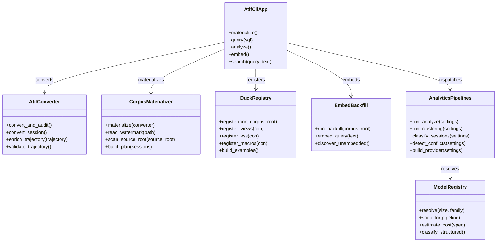

# atif-sql · Components

## Legend

### Classes

Each node is one uv workspace member, the unit the seven import-linter contracts
at `pyproject.toml:364-425` constrain. Every use case and registration entry point
is a module-level function, so the `+` entries are functions rather than methods.
`AtifCliApp`'s five entries each carry an `@app.command` decorator on the line
above; `app` is the `cyclopts.App` at `packages/atif-cli/src/atif_cli/app.py:52`
and `main` at `packages/atif-cli/src/atif_cli/app.py:1125` is the `atif-sql`
console script declared at `packages/atif-cli/pyproject.toml:43`.

| Class | Workspace member | Method entry | Declared at |
| --- | --- | --- | --- |
| `AtifCliApp` | atif-cli | `materialize` | `packages/atif-cli/src/atif_cli/app.py:352` |
| `AtifCliApp` | atif-cli | `query` | `packages/atif-cli/src/atif_cli/app.py:529` |
| `AtifCliApp` | atif-cli | `analyze` | `packages/atif-cli/src/atif_cli/app.py:659` |
| `AtifCliApp` | atif-cli | `embed` | `packages/atif-cli/src/atif_cli/app.py:766` |
| `AtifCliApp` | atif-cli | `search` | `packages/atif-cli/src/atif_cli/app.py:860` |
| `AtifConverter` | atif-converter | `convert_and_audit` | `packages/atif-converter/src/atif_converter/application/convert_and_audit.py:105` |
| `AtifConverter` | atif-converter | `convert_session` | `packages/atif-converter/src/atif_converter/infrastructure/harbor_adapter.py:142` |
| `AtifConverter` | atif-converter | `enrich_trajectory` | `packages/atif-converter/src/atif_converter/domain/enrichment.py:198` |
| `AtifConverter` | atif-converter | `validate_trajectory` | `packages/atif-converter/src/atif_converter/infrastructure/harbor_adapter.py:97` |
| `CorpusMaterializer` | atif-corpus | `materialize` | `packages/atif-corpus/src/atif_corpus/application/materialize.py:476` |
| `CorpusMaterializer` | atif-corpus | `read_watermark` | `packages/atif-corpus/src/atif_corpus/application/materialize.py:160` |
| `CorpusMaterializer` | atif-corpus | `scan_source_root` | `packages/atif-corpus/src/atif_corpus/infrastructure/scanner.py:211` |
| `CorpusMaterializer` | atif-corpus | `build_plan` | `packages/atif-corpus/src/atif_corpus/domain/sessions.py:159` |
| `DuckRegistry` | atif-duck | `register` | `packages/atif-duck/src/atif_duck/infrastructure/registry.py:1212` |
| `DuckRegistry` | atif-duck | `register_views` | `packages/atif-duck/src/atif_duck/infrastructure/registry.py:317` |
| `DuckRegistry` | atif-duck | `register_vss` | `packages/atif-duck/src/atif_duck/infrastructure/registry.py:830` |
| `DuckRegistry` | atif-duck | `register_macros` | `packages/atif-duck/src/atif_duck/infrastructure/registry.py:989` |
| `DuckRegistry` | atif-duck | `build_examples` | `packages/atif-duck/src/atif_duck/domain/examples.py:178` |
| `EmbedBackfill` | atif-embed | `run_backfill` | `packages/atif-embed/src/atif_embed/application/embed.py:61` |
| `EmbedBackfill` | atif-embed | `embed_query` | `packages/atif-embed/src/atif_embed/application/embed.py:265` |
| `EmbedBackfill` | atif-embed | `discover_unembedded` | `packages/atif-embed/src/atif_embed/application/embed.py:43` |
| `AnalyticsPipelines` | atif-analytics | `run_analyze` | `packages/atif-analytics/src/atif_analytics/application/analyze.py:36` |
| `AnalyticsPipelines` | atif-analytics | `run_clustering` | `packages/atif-analytics/src/atif_analytics/application/use_cases/cluster.py:50` |
| `AnalyticsPipelines` | atif-analytics | `classify_sessions` | `packages/atif-analytics/src/atif_analytics/application/use_cases/classify.py:342` |
| `AnalyticsPipelines` | atif-analytics | `detect_conflicts` | `packages/atif-analytics/src/atif_analytics/application/use_cases/conflicts.py:337` |
| `AnalyticsPipelines` | atif-analytics | `build_provider` | `packages/atif-analytics/src/atif_analytics/application/use_cases/_shared.py:32` |
| `ModelRegistry` | atif-models | `resolve` | `packages/atif-models/src/atif_models/domain/registry.py:109` |
| `ModelRegistry` | atif-models | `spec_for` | `packages/atif-models/src/atif_models/infrastructure/settings.py:79` |
| `ModelRegistry` | atif-models | `estimate_cost` | `packages/atif-models/src/atif_models/domain/registry.py:125` |
| `ModelRegistry` | atif-models | `classify_structured` | `packages/atif-models/src/atif_models/domain/ports.py:123`, the sole method of the `LlmStructuredProvider` Protocol at `packages/atif-models/src/atif_models/domain/ports.py:116`, implemented by `OpenAiBedrockProvider` at `packages/atif-models/src/atif_models/infrastructure/openai_bedrock.py:217` |

`register` calls the other three registrars in binding order at
`packages/atif-duck/src/atif_duck/infrastructure/registry.py:1267-1276`;
`run_analyze` dispatches the five LLM stages from a table at
`packages/atif-analytics/src/atif_analytics/application/analyze.py:154-160`.

### Relationships

Every edge is one import plus one call. **Every cross-package import in this
workspace is indented into the function body that needs it**, never at module top.
A fresh-interpreter test asserts that a bare `import atif_cli.app` pulls in none
of `duckdb`, `harbor`, `lancedb`, `boto3`, or `polars` —
`_FORBIDDEN_EAGER_IMPORTS` at `packages/atif-cli/tests/test_lean_import.py:17-31`
— and `packages/atif-cli/src/atif_cli/app.py:22-25` records that as the reason the
heavy imports sit in the command bodies. A line-anchored grep for `^from atif_`
therefore finds none of these six edges.

Five edges originate at `AtifCliApp`, which
`packages/atif-cli/src/atif_cli/app.py:3-7` names the workspace's composition
root. Those five are the whole of its outbound surface: an unanchored grep for
`from atif_(converter|corpus|duck|models|embed|analytics)` across
`packages/atif-cli/src` returns 26 hits spanning exactly those five members, and
**atif-cli never imports atif-models**.

| Edge | Verb | Import site | Call site |
| --- | --- | --- | --- |
| `AtifCliApp -> AtifConverter` | converts | `packages/atif-cli/src/atif_cli/app.py:253` | `packages/atif-cli/src/atif_cli/app.py:261` |
| `AtifCliApp -> CorpusMaterializer` | materializes | `packages/atif-cli/src/atif_cli/app.py:388` | `packages/atif-cli/src/atif_cli/app.py:396` |
| `AtifCliApp -> DuckRegistry` | registers | `packages/atif-cli/src/atif_cli/app.py:615`, `packages/atif-cli/src/atif_cli/app.py:906` | `packages/atif-cli/src/atif_cli/app.py:626`, `packages/atif-cli/src/atif_cli/app.py:918` |
| `AtifCliApp -> AnalyticsPipelines` | dispatches | `packages/atif-cli/src/atif_cli/app.py:720` | `packages/atif-cli/src/atif_cli/app.py:739` |
| `AtifCliApp -> EmbedBackfill` | embeds | `packages/atif-cli/src/atif_cli/app.py:806` | `packages/atif-cli/src/atif_cli/app.py:826` |
| `AnalyticsPipelines -> ModelRegistry` | resolves | `packages/atif-analytics/src/atif_analytics/application/use_cases/_shared.py:41` | `packages/atif-analytics/src/atif_analytics/application/use_cases/_shared.py:45` |

### Relationships the import contracts forbid

`pyproject.toml:416-419` declares an `independence` contract over
`atif_converter`, `atif_corpus`, `atif_duck`, `atif_models`, and `atif_embed`, so
no edge may connect any two of those five. `pyproject.toml:421-425` declares a
`forbidden` contract admitting exactly one analytics edge — to `atif_models`. Both
are checked by `lint:imports`, the fifth of the nine gates `mise run check`
depends on (`mise.toml:204`, in the list at `mise.toml:199-211`).

A Protocol declared in one member and implemented in another is **not** an edge
between them: the implementation satisfies it structurally, and the composition
root supplies the instance. Neither is a permission comment an edge —
`pyproject.toml:411` reads "ONLY atif-cli and atif-analytics may import
atif-models", which grants reach that atif-cli does not take.

| Absent edge | How the same work reaches across the boundary |
| --- | --- |
| `CorpusMaterializer -> AtifConverter` | `materialize` takes a `ConverterPort` parameter (`packages/atif-corpus/src/atif_corpus/application/materialize.py:480`), the Protocol at `packages/atif-corpus/src/atif_corpus/domain/ports.py:41`. `AtifCliApp` constructs the `RealConverter` adapter (`packages/atif-cli/src/atif_cli/converter_adapter.py:44`) and injects it at `packages/atif-cli/src/atif_cli/app.py:399`; that adapter's docstring names the independence contract as its reason to live in atif-cli (`packages/atif-cli/src/atif_cli/converter_adapter.py:5-9`). |
| `EmbedBackfill -> DuckRegistry` | `EmbedBackfill` reads the corpus through its own DuckDB `TextRowsPort` adapter, `DuckDbTextRows` (`packages/atif-embed/src/atif_embed/infrastructure/corpus_text_rows.py:155`) against the Protocol at `packages/atif-embed/src/atif_embed/domain/ports.py:87`, over the `docs/CONTRACT.md` corpus layout — stated at `pyproject.toml:360-362`. |
| `AnalyticsPipelines -> CorpusMaterializer` | `AnalyticsPipelines` reads the materialized corpus directly through its own `CorpusReader` (`packages/atif-analytics/src/atif_analytics/infrastructure/corpus_reader.py:138`), constructed once per run at `packages/atif-analytics/src/atif_analytics/application/analyze.py:74`. |
| `AtifCliApp -> ModelRegistry` | `AtifCliApp` never reaches atif-models. Model selection happens inside `AnalyticsPipelines`, whose `build_provider` resolves a spec through `spec_for` (`packages/atif-analytics/src/atif_analytics/application/use_cases/_shared.py:44`) — so no model id is written down outside atif-models. |

| Absent edge | How the same work reaches across the boundary |
| --- | --- |
| `CorpusMaterializer -> AtifConverter` | `materialize` takes a `ConverterPort` parameter (`packages/atif-corpus/src/atif_corpus/application/materialize.py:480`), the Protocol at `packages/atif-corpus/src/atif_corpus/domain/ports.py:41`. `AtifCliApp` constructs the `RealConverter` adapter (`packages/atif-cli/src/atif_cli/converter_adapter.py:44`) and injects it at `packages/atif-cli/src/atif_cli/app.py:399`; that adapter's docstring names the independence contract as its reason to live in atif-cli (`packages/atif-cli/src/atif_cli/converter_adapter.py:5-9`). |
| `EmbedBackfill -> DuckRegistry` | `EmbedBackfill` reads the corpus through its own DuckDB `TextRowsPort` adapter, `DuckDbTextRows` (`packages/atif-embed/src/atif_embed/infrastructure/corpus_text_rows.py:155`) against the Protocol at `packages/atif-embed/src/atif_embed/domain/ports.py:87`, over the `docs/CONTRACT.md` corpus layout — stated at `pyproject.toml:360-362`. |
| `AnalyticsPipelines -> CorpusMaterializer` | `AnalyticsPipelines` reads the materialized corpus directly through its own `CorpusReader` (`packages/atif-analytics/src/atif_analytics/infrastructure/corpus_reader.py:138`), constructed once per run at `packages/atif-analytics/src/atif_analytics/application/analyze.py:74`. |

## See also

- [module map](../../architecture/module-map.md) — 23 shared source citations
- [processes](../../behavior/processes.md) — 23 shared source citations
- [impact analysis](../../insights/impact-analysis.md) — 23 shared source citations
- [contract map](../../insights/contract-map.md) — 20 shared source citations
- [business logic](../../insights/business-logic.md) — 18 shared source citations
