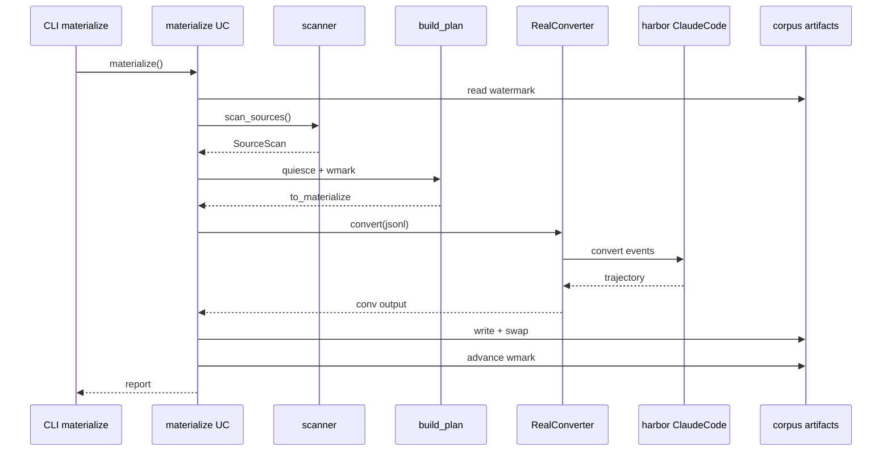
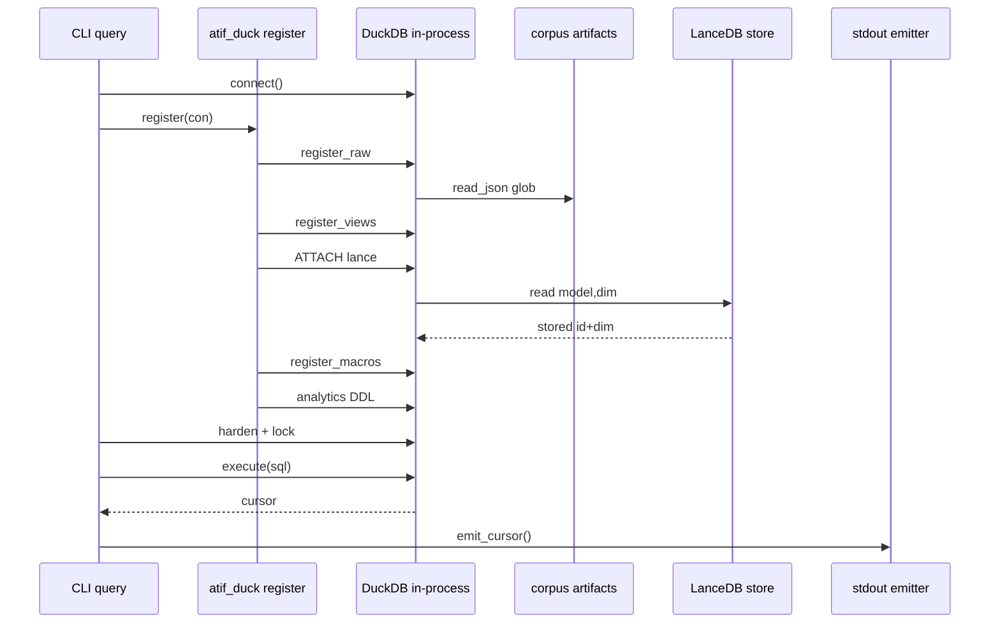
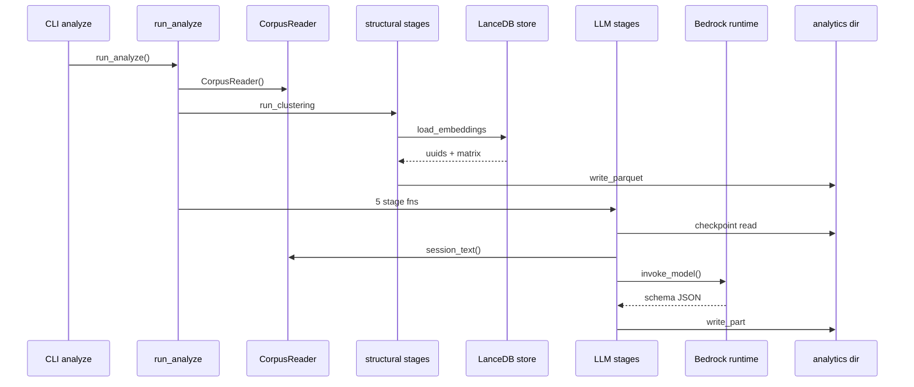

# atif-sql · Sequences

## materialize

Sources, in dispatch order:

- CLI materialize — `packages/atif-cli/src/atif_cli/app.py:352`; report rendered at `:299`.
- materialize UC — `packages/atif-corpus/src/atif_corpus/application/materialize.py:476`;
  `read_watermark` at `:160` called from `:521`, `scan_sources` called at `:522`, `build_plan` called
  at `:572`, `_write_session` at `:179` called from `:588`, watermark advanced at `:610`, report
  built at `:613`.
- scanner — `packages/atif-corpus/src/atif_corpus/infrastructure/scanner.py:143`.
- build_plan — `packages/atif-corpus/src/atif_corpus/domain/sessions.py:159`.
- RealConverter — `packages/atif-cli/src/atif_cli/converter_adapter.py:51`, calling
  `packages/atif-converter/src/atif_converter/application/convert_and_audit.py:105`.
- converter — our ported Claude Code converter,
  `packages/atif-converter/src/atif_converter/domain/claude_code_conversion.py:75`, reached from the
  seam at `packages/atif-converter/src/atif_converter/infrastructure/harbor_adapter.py:83`; harbor
  supplies only the data classes and the validator (`:68`).
- corpus artifacts — path arithmetic in
  `packages/atif-corpus/src/atif_corpus/domain/layout.py:26`; the four artifacts written and the
  directory swapped at `packages/atif-corpus/src/atif_corpus/application/materialize.py:222-240`
  through `packages/atif-corpus/src/atif_corpus/infrastructure/atomic.py:64` and `:98`.

## query

Sources, in dispatch order:

- CLI query — `packages/atif-cli/src/atif_cli/app.py:529`; `duckdb.connect()` at `:591`, `register`
  called at `:594`, `_harden_query_connection` at `:137` called from `:601`, caller SQL executed at
  `:606`, emit at `:612`.
- atif_duck register — `packages/atif-duck/src/atif_duck/infrastructure/registry.py:1212`, whose
  documented order is fixed at `:1283-1294`: `register_raw` `:196`, `register_views` `:333`,
  `register_vss` `:846`, `register_macros` `:1005`, then the analytics pair.
- DuckDB in-process — the connection opened by the CLI; the sandbox settings and
  `lock_configuration` are issued against it at `packages/atif-cli/src/atif_cli/app.py:180-188`.
- corpus artifacts — session globs read through `read_json` at
  `packages/atif-duck/src/atif_duck/infrastructure/registry.py:210-213`; the analytics parquets bind
  through `packages/atif-duck/src/atif_duck/infrastructure/analytics.py:124`, with the analytics
  macros at `:225`.
- LanceDB store — reached through DuckDB's lance extension:
  `packages/atif-duck/src/atif_duck/infrastructure/registry.py:878-887` installs, loads, and
  ATTACHes it; the stamped `(model, dim)` identity is read at `:937` and checked by
  `packages/atif-duck/src/atif_duck/domain/embedding_guard.py:46`.
- stdout emitter — `packages/atif-cli/src/atif_cli/output.py:154`; a registration failure routes
  through `packages/atif-cli/src/atif_cli/duck_errors.py:66` instead.

## analyze

Sources, in dispatch order:

- CLI analyze — `packages/atif-cli/src/atif_cli/app.py:659`; settings resolved at `:691`,
  `run_analyze` called at `:707`.
- run_analyze — `packages/atif-analytics/src/atif_analytics/application/analyze.py:36`; lane
  selectors at `:65-66`, the five-entry LLM `stages` list at `:154-160`, each stage invoked at
  `:181`.
- CorpusReader — `packages/atif-analytics/src/atif_analytics/infrastructure/corpus_reader.py:138`,
  constructed once per run at
  `packages/atif-analytics/src/atif_analytics/application/analyze.py:74`; `session_text` at
  `packages/atif-analytics/src/atif_analytics/infrastructure/corpus_reader.py:284`.
- structural stages — `run_clustering`
  `packages/atif-analytics/src/atif_analytics/application/use_cases/cluster.py:50`, `run_terms`
  `packages/atif-analytics/src/atif_analytics/application/use_cases/terms.py:54`, `run_communities`
  `packages/atif-analytics/src/atif_analytics/application/use_cases/community.py:94`.
- LanceDB store — `load_embeddings`
  `packages/atif-analytics/src/atif_analytics/infrastructure/lance_reader.py:28`, called from
  `packages/atif-analytics/src/atif_analytics/application/use_cases/cluster.py:62`; `lancedb.connect`
  at `packages/atif-analytics/src/atif_analytics/infrastructure/lance_reader.py:40`.
- LLM stages — the classify exemplar at
  `packages/atif-analytics/src/atif_analytics/application/use_cases/classify.py:342`; provider built
  by `packages/atif-analytics/src/atif_analytics/application/use_cases/_shared.py:32`, structured
  call dispatched at
  `packages/atif-analytics/src/atif_analytics/application/use_cases/classify.py:194`.
- Bedrock runtime — `OpenAiBedrockProvider.classify_structured`
  `packages/atif-models/src/atif_models/infrastructure/openai_bedrock.py:217`, blocking
  `invoke_model` at `:261` on the `bedrock-runtime` client built at `:195`.
- analytics dir — `<corpus_root>/analytics/`, defined at
  `packages/atif-analytics/src/atif_analytics/domain/layout.py:51`, holding both the sharded parquet
  caches (`write_part`
  `packages/atif-analytics/src/atif_analytics/infrastructure/parquet_cache.py:90`, called at
  `packages/atif-analytics/src/atif_analytics/application/use_cases/classify.py:264`) and the single
  SQLite WAL `state.db`
  (`packages/atif-analytics/src/atif_analytics/domain/layout.py:106`).
- analytics dir, SQLite arm — `filter_unchanged`
  `packages/atif-analytics/src/atif_analytics/infrastructure/sqlite_state/checkpointer.py:136` called
  at `packages/atif-analytics/src/atif_analytics/application/use_cases/classify.py:99`;
  `mark_completed`
  `packages/atif-analytics/src/atif_analytics/infrastructure/sqlite_state/checkpointer.py:299` called
  at `packages/atif-analytics/src/atif_analytics/application/use_cases/classify.py:272`; retry drain
  `packages/atif-analytics/src/atif_analytics/infrastructure/sqlite_state/retry_queue.py:265` called
  at `packages/atif-analytics/src/atif_analytics/application/use_cases/classify.py:108`.

## See also

- [processes](../../behavior/processes.md) — 26 shared source citations
- [debugging guide](../../insights/debugging-guide.md) — 18 shared source citations
- [module map](../../architecture/module-map.md) — 17 shared source citations
- [business logic](../../insights/business-logic.md) — 17 shared source citations
- [data flow](../../architecture/data-flow.md) — 16 shared source citations
