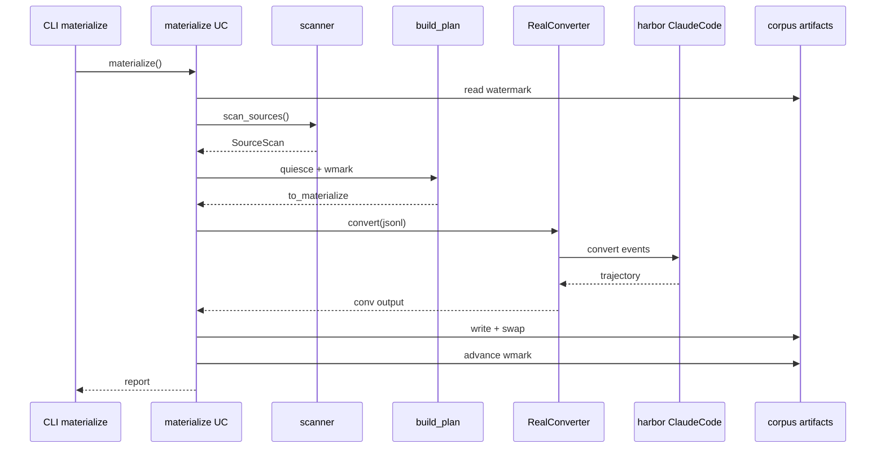
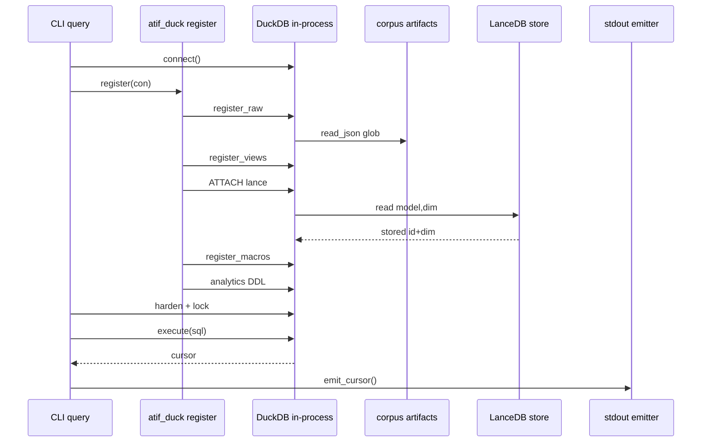
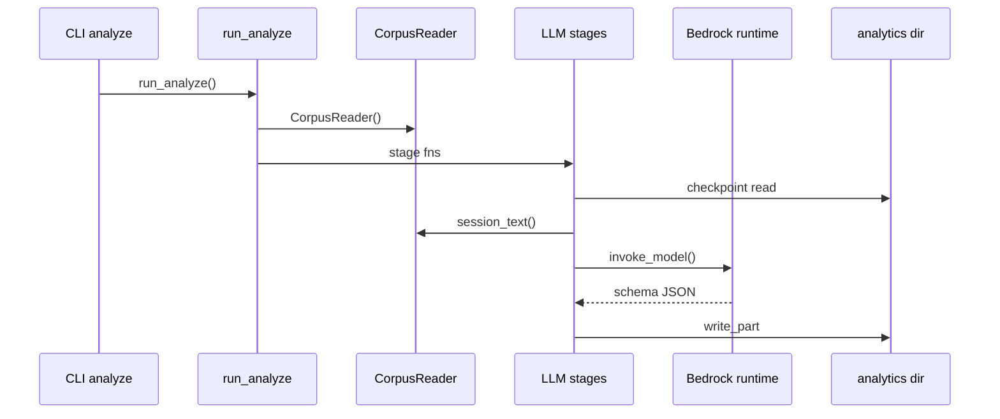

# atif-sql · Sequences

## materialize

```mermaid
sequenceDiagram
    participant CLI as CLI materialize
    participant UC as materialize UC
    participant SCAN as scanner
    participant PLAN as build_plan
    participant ADP as RealConverter
    participant HB as harbor ClaudeCode
    participant FS as corpus artifacts
    CLI->>UC: materialize()
    UC->>FS: read watermark
    UC->>SCAN: scan_sources()
    SCAN-->>UC: SourceScan
    UC->>PLAN: quiesce + wmark
    PLAN-->>UC: to_materialize
    UC->>ADP: convert(jsonl)
    ADP->>HB: convert events
    HB-->>ADP: trajectory
    ADP-->>UC: conv output
    UC->>FS: write + swap
    UC->>FS: advance wmark
    UC-->>CLI: report
```

Sources, in dispatch order:

- CLI materialize — `packages/atif-cli/src/atif_cli/app.py:352`; report rendered at `:299`.
- materialize UC — `packages/atif-corpus/src/atif_corpus/application/materialize.py:476`;
  `read_watermark` at `:160` called from `:521`, `scan_sources` called at `:522`, `build_plan` called
  at `:572`, `_write_session` at `:179` called from `:588`, watermark advanced at `:610`, report
  built at `:613`.
- scanner — `packages/atif-corpus/src/atif_corpus/infrastructure/scanner.py:143`.
- build_plan — `packages/atif-corpus/src/atif_corpus/domain/sessions.py:159`.
- RealConverter — `packages/atif-cli/src/atif_cli/converter_adapter.py:51`, calling
  `packages/atif-converter/src/atif_converter/application/convert_and_audit.py:105`.
- converter — our ported Claude Code converter,
  `packages/atif-converter/src/atif_converter/domain/claude_code_conversion.py:75`, reached from the
  seam at `packages/atif-converter/src/atif_converter/infrastructure/harbor_adapter.py:83`; harbor
  supplies only the data classes and the validator (`:68`).
- corpus artifacts — path arithmetic in
  `packages/atif-corpus/src/atif_corpus/domain/layout.py:26`; the artifacts written and the
  directory swapped at `packages/atif-corpus/src/atif_corpus/application/materialize.py:222-240`
  through `packages/atif-corpus/src/atif_corpus/infrastructure/atomic.py:64` and `:98`.

## query

```mermaid
sequenceDiagram
    participant CLI as CLI query
    participant REG as atif_duck register
    participant DB as DuckDB in-process
    participant FS as corpus artifacts
    participant LN as LanceDB store
    participant OUT as stdout emitter
    CLI->>DB: connect()
    CLI->>REG: register(con)
    REG->>DB: register_raw
    DB->>FS: read_json glob
    REG->>DB: register_views
    REG->>DB: ATTACH lance
    DB->>LN: read model,dim
    LN-->>DB: stored id+dim
    REG->>DB: register_macros
    REG->>DB: analytics DDL
    CLI->>DB: harden + lock
    CLI->>DB: execute(sql)
    DB-->>CLI: cursor
    CLI->>OUT: emit_cursor()
```

Sources, in dispatch order:

- CLI query — `packages/atif-cli/src/atif_cli/app.py:529`; `duckdb.connect()` at `:591`, `register`
  called at `:594`, `_harden_query_connection` at `:137` called from `:601`, caller SQL executed at
  `:606`, emit at `:612`.
- atif_duck register — `packages/atif-duck/src/atif_duck/infrastructure/registry.py:1212`, whose
  documented order is fixed at `:1283-1294`: `register_raw` `:196`, `register_views` `:333`,
  `register_vss` `:846`, `register_macros` `:1005`, then the analytics pair.
- DuckDB in-process — the connection opened by the CLI; the sandbox settings and
  `lock_configuration` are issued against it at `packages/atif-cli/src/atif_cli/app.py:180-188`.
- corpus artifacts — session globs read through `read_json` at
  `packages/atif-duck/src/atif_duck/infrastructure/registry.py:210-213`; the analytics parquets bind
  through `packages/atif-duck/src/atif_duck/infrastructure/analytics.py:124`, with the analytics
  macros at `:225`.
- LanceDB store — reached through DuckDB's lance extension:
  `packages/atif-duck/src/atif_duck/infrastructure/registry.py:878-887` installs, loads, and
  ATTACHes it; the stamped `(model, dim)` identity is read at `:937` and checked by
  `packages/atif-duck/src/atif_duck/domain/embedding_guard.py:46`.
- stdout emitter — `packages/atif-cli/src/atif_cli/output.py:154`; a registration failure routes
  through `packages/atif-cli/src/atif_cli/duck_errors.py:66` instead.

## analyze

```mermaid
sequenceDiagram
    participant CLI as CLI analyze
    participant ORCH as run_analyze
    participant RD as CorpusReader
    participant LLM as LLM stages
    participant BR as Bedrock runtime
    participant AN as analytics dir
    CLI->>ORCH: run_analyze()
    ORCH->>RD: CorpusReader()
    ORCH->>LLM: stage fns
    LLM->>AN: checkpoint read
    LLM->>RD: session_text()
    LLM->>BR: invoke_model()
    BR-->>LLM: schema JSON
    LLM->>AN: write_part
```

Sources, in dispatch order:

- CLI analyze — `packages/atif-cli/src/atif_cli/app.py:1240`; settings resolved at `:1296`,
  `run_analyze` called at `:1312`.
- run_analyze — `packages/atif-analytics/src/atif_analytics/application/analyze.py:36`; the
  `stages` list at `:97-102`, each stage invoked at `:123`.
- CorpusReader — `packages/atif-analytics/src/atif_analytics/infrastructure/corpus_reader.py:143`,
  constructed once per run at
  `packages/atif-analytics/src/atif_analytics/application/analyze.py:57`; `session_text` at
  `packages/atif-analytics/src/atif_analytics/infrastructure/corpus_reader.py:289`.
- LLM stages — the classify exemplar at
  `packages/atif-analytics/src/atif_analytics/application/use_cases/classify.py:368`; provider built
  by `packages/atif-analytics/src/atif_analytics/application/use_cases/_shared.py:36`, structured
  call dispatched at
  `packages/atif-analytics/src/atif_analytics/application/use_cases/classify.py:214`.
- Bedrock runtime — `OpenAiBedrockProvider.classify_structured`
  `packages/atif-models/src/atif_models/infrastructure/openai_bedrock.py:217`, blocking
  `invoke_model` at `:261` on the `bedrock-runtime` client built at `:195`.
- analytics dir — `<corpus_root>/analytics/`, defined at
  `packages/atif-analytics/src/atif_analytics/domain/layout.py:51`, holding both the sharded parquet
  caches (`write_part`
  `packages/atif-analytics/src/atif_analytics/infrastructure/parquet_cache.py:90`, called at
  `packages/atif-analytics/src/atif_analytics/application/use_cases/classify.py:278`) and the single
  SQLite WAL `state.db`
  (`packages/atif-analytics/src/atif_analytics/domain/layout.py:81`).
- analytics dir, SQLite arm — `filter_unchanged`
  `packages/atif-analytics/src/atif_analytics/infrastructure/sqlite_state/checkpointer.py:137` called
  at `packages/atif-analytics/src/atif_analytics/application/use_cases/classify.py:111`;
  `mark_completed`
  `packages/atif-analytics/src/atif_analytics/infrastructure/sqlite_state/checkpointer.py:300` called
  at `packages/atif-analytics/src/atif_analytics/application/use_cases/classify.py:286`; retry drain
  `packages/atif-analytics/src/atif_analytics/infrastructure/sqlite_state/retry_queue.py:265` called
  at `packages/atif-analytics/src/atif_analytics/application/use_cases/classify.py:120`.

## See also

- [processes](../../behavior/processes.md)
- [debugging guide](../../insights/debugging-guide.md)
- [module map](../../architecture/module-map.md)
- [business logic](../../insights/business-logic.md)
- [data flow](../../architecture/data-flow.md)
