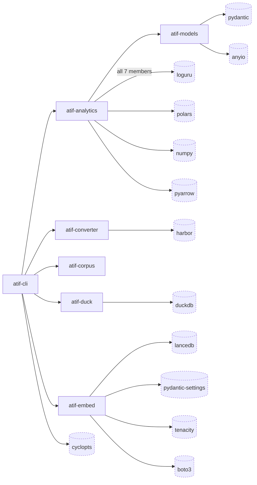

# atif-sql · Dependency graph

Seven internal modules and their thirteen highest-frequency external dependencies. Internal nodes are
the uv workspace members declared by `[tool.uv.workspace] members = ["packages/*"]`
(`pyproject.toml:99-100`); external nodes are first-order distributions taken from a member's own
`[project.dependencies]`, never from the installed transitive closure.

The internal direction is enforced rather than conventional. `pyproject.toml:462` declares
`[tool.importlinter]` over all seven root packages (`:366`), and `mise run lint:imports`
(`mise.toml:159-162`) is one of the nine gates `mise run check` depends on (`mise.toml:197-211`). Two of
those contracts fix the shape drawn here: the `independence` contract at `pyproject.toml:514-517`
forbids any import edge among atif_converter, atif_corpus, atif_duck, atif_models, and atif_embed, and
the `forbidden` contract at `:422-426` allows atif_analytics to import atif_models and nothing else
among the seven.

## Legend (overflow)

Six declared external distributions are elided to hold the 20-node cap. Edge count is the number of
internal modules whose `src/` imports the distribution, measured by grepping every `*.py` under
`packages/*/src` for a `from X` or `import X` line at any indentation.

| elided node | edges | importing module | declared at | import site |
| --- | --- | --- | --- | --- |
| scipy | 1 | atif-analytics | `packages/atif-analytics/pyproject.toml:37` | `packages/atif-analytics/src/atif_analytics/domain/structure/community.py:82` |
| umap-learn | 1 | atif-analytics | `packages/atif-analytics/pyproject.toml:38` | `packages/atif-analytics/src/atif_analytics/domain/structure/cluster.py:48` |
| scikit-learn | 1 | atif-analytics | `packages/atif-analytics/pyproject.toml:36` | `packages/atif-analytics/src/atif_analytics/domain/structure/terms.py:39` |
| hdbscan | 1 | atif-analytics | `packages/atif-analytics/pyproject.toml:26` | `packages/atif-analytics/src/atif_analytics/domain/structure/cluster.py:47` |
| graspologic-native | 1 | atif-analytics | `packages/atif-analytics/pyproject.toml:25` | `packages/atif-analytics/src/atif_analytics/domain/structure/community.py:261` |
| pytz | 0 | none | `packages/atif-duck/pyproject.toml:25` | no import site; DuckDB's own client imports it to materialize TIMESTAMPTZ, per the comment at `:22-24` |

All five clustering and community-detection libraries hang off atif-analytics alone, so the elision
costs the diagram no structural information: it drops five leaves from one node that already carries
four drawn external edges.

## Internal edges

Exactly six ordered pairs of members import each other. Counts are importing-file counts under the
source member's `src/`.

| edge | files | contract that permits it |
| --- | --- | --- |
| atif-cli to atif-analytics | 1 | atif-cli is the composition root; it is absent from both restrictive contracts (`pyproject.toml:517`, `:426`) |
| atif-cli to atif-converter | 2 | as above; declared `packages/atif-cli/pyproject.toml:33` |
| atif-cli to atif-corpus | 2 | as above; declared `packages/atif-cli/pyproject.toml:34` |
| atif-cli to atif-duck | 2 | as above; declared `packages/atif-cli/pyproject.toml:35` |
| atif-cli to atif-embed | 1 | as above; declared `packages/atif-cli/pyproject.toml:36` |
| atif-analytics to atif-models | 7 | the `forbidden` contract's single permitted edge (`pyproject.toml:519-523`); declared `packages/atif-analytics/pyproject.toml:24` |

Two absences carry meaning. atif-cli imports atif_models in zero source files even though it composes
everything else — it reaches the model registry through atif-analytics, and its
`[project.dependencies]` list omits atif-models accordingly (`packages/atif-cli/pyproject.toml:32-39`).
And no edge exists in either direction between atif-converter, atif-corpus, atif-duck, atif-embed, or
atif-models: they communicate only by writing and reading the corpus on disk. Adding any such edge
fails gate 5 of `mise run check`.

The five inter-member dependencies are `==0.1.0`-pinned rather than bare
(`packages/atif-cli/pyproject.toml:32-36`) because `[tool.uv.sources]` at `:59-64` is a local source an
external installer never sees; a bare name would ship as a `Requires-Dist` resolved from the public
PyPI namespace.

## External edges and where each is sourced

One edge per external distribution, drawn from the member whose files import it most often. Ties break
on import-site count, then on the member's own src line count, descending. `files` counts importing
files across all seven members' `src/`.

| external node | files | edge drawn from | declared at | import site |
| --- | --- | --- | --- | --- |
| loguru | 33 | atif-analytics | `packages/atif-analytics/pyproject.toml:28` | `packages/atif-analytics/src/atif_analytics/application/analyze.py:30` |
| polars | 13 | atif-analytics | `packages/atif-analytics/pyproject.toml:33` | `packages/atif-analytics/src/atif_analytics/application/use_cases/cluster.py:18` |
| pydantic | 7 | atif-models | `packages/atif-models/pyproject.toml:26` | `packages/atif-models/src/atif_models/infrastructure/openai_bedrock.py:41` |
| numpy | 6 | atif-analytics | `packages/atif-analytics/pyproject.toml:32` | `packages/atif-analytics/src/atif_analytics/application/use_cases/cluster.py:17` |
| duckdb | 5 | atif-duck | `packages/atif-duck/pyproject.toml:20` | `packages/atif-duck/src/atif_duck/infrastructure/registry.py:60` |
| pydantic-settings | 4 | atif-embed | `packages/atif-embed/pyproject.toml:27` | `packages/atif-embed/src/atif_embed/infrastructure/settings.py:16` |
| tenacity | 2 | atif-embed | `packages/atif-embed/pyproject.toml:28` | `packages/atif-embed/src/atif_embed/infrastructure/cohere_bedrock.py:36` |
| pyarrow | 2 | atif-analytics | `packages/atif-analytics/pyproject.toml:34` | `packages/atif-analytics/src/atif_analytics/infrastructure/parquet_cache.py:137` |
| lancedb | 2 | atif-embed | `packages/atif-embed/pyproject.toml:22` | `packages/atif-embed/src/atif_embed/infrastructure/lance_store.py:42` |
| anyio | 2 | atif-models | `packages/atif-models/pyproject.toml:19` | `packages/atif-models/src/atif_models/infrastructure/openai_bedrock.py:29` |
| cyclopts | 2 | atif-cli | `packages/atif-cli/pyproject.toml:37` | `packages/atif-cli/src/atif_cli/app.py:35` |
| boto3 | 2 | atif-embed | `packages/atif-embed/pyproject.toml:20` | `packages/atif-embed/src/atif_embed/infrastructure/cohere_bedrock.py:136` |
| harbor | 1 | atif-converter | `packages/atif-converter/pyproject.toml:23` | `packages/atif-converter/src/atif_converter/infrastructure/harbor_adapter.py:161` |

Three readings the drawn edge deliberately compresses:

- **loguru is universal.** All seven members declare it — `packages/atif-analytics/pyproject.toml:28`,
  `packages/atif-cli/pyproject.toml:38`, `packages/atif-converter/pyproject.toml:24`,
  `packages/atif-corpus/pyproject.toml:19`, `packages/atif-duck/pyproject.toml:21`,
  `packages/atif-embed/pyproject.toml:23`, `packages/atif-models/pyproject.toml:25` — and the edge is
  drawn from atif-analytics only because 17 of the 33 importing files are its. The edge label states
  the real fan-out.
- **atif-corpus has no drawn external edge.** It declares three externals — loguru
  (`packages/atif-corpus/pyproject.toml:19`), pydantic (`:20`), pydantic-settings (`:21`) — and each is
  imported more often, or in more sites, by another member, so the attribution rule sources all three
  elsewhere. Its own import sites are real: `packages/atif-corpus/src/atif_corpus/infrastructure/settings.py:19`
  and `packages/atif-corpus/src/atif_corpus/domain/sessions.py:29`.
- **harbor is a public-API edge now.** `packages/atif-converter/pyproject.toml:26` pins
  `harbor>=0.22.0,<1`, and production code imports two things from it: the ATIF data classes
  (`harbor.models.trajectories`, e.g. `packages/atif-converter/src/atif_converter/infrastructure/codex_converter.py:36`)
  and the validator (`packages/atif-converter/src/atif_converter/infrastructure/harbor_adapter.py:68`).
  The conversion itself is ours, ported from 0.22.0
  (`packages/atif-converter/src/atif_converter/domain/claude_code_conversion.py:75`,
  `packages/atif-converter/src/atif_converter/domain/codex_conversion.py:781`). An `ast` guard pins
  the allowlist (`packages/atif-converter/tests/test_harbor_public_surface_guard.py:29`), and
  harbor's private converters are reachable from the parity oracle in the tests only
  (`packages/atif-converter/tests/harbor_oracle.py:94`). harbor ships no `py.typed` marker, so each
  import site carries an `import-untyped` ignore.

## Declared dependencies are not the installed closure

The diagram's external nodes are what a member asks for, and that is a strictly smaller set than what
`uv sync` installs. The gap includes a web stack this system never runs: harbor's own dependency block
at `uv.lock:1139-1164` lists `fastapi` (`:1082`), `supabase` (`:1097`), and `uvicorn` (`:1101`), so all
three are in the installed closure. No member declares any of them, and
`grep -rnE "^[[:space:]]*(from|import) +(fastapi|uvicorn|starlette|supabase)(\.| |$)" --include='*.py' packages/`
returns zero matches across every source and test file. atif-sql exposes no HTTP surface; it is one
console script, `atif-sql = "atif_cli.app:main"` (`packages/atif-cli/pyproject.toml:42`), over a set of
libraries.

Every storage engine in the graph is embedded, so no server node belongs here either: duckdb runs
in-process (`packages/atif-duck/pyproject.toml:20`) and lancedb is a local vector store
(`packages/atif-embed/pyproject.toml:22`). The only edge that leaves the machine is boto3 to Amazon
Bedrock, from `packages/atif-embed/src/atif_embed/infrastructure/cohere_bedrock.py:136` and
`packages/atif-models/src/atif_models/infrastructure/openai_bedrock.py:31`.

## See also

- [module map](../../architecture/module-map.md) — 13 shared source citations
- [processes](../../behavior/processes.md) — 13 shared source citations
- [contract map](../../insights/contract-map.md) — 12 shared source citations
- [impact analysis](../../insights/impact-analysis.md) — 11 shared source citations
- [tech debt](../../insights/tech-debt.md) — 11 shared source citations
